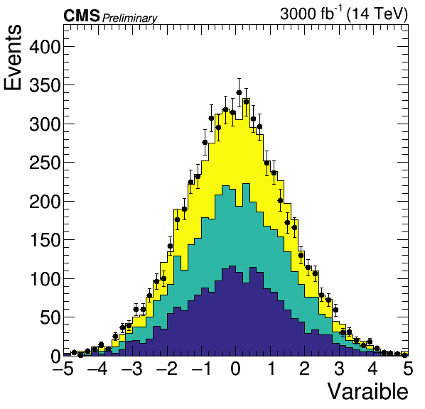
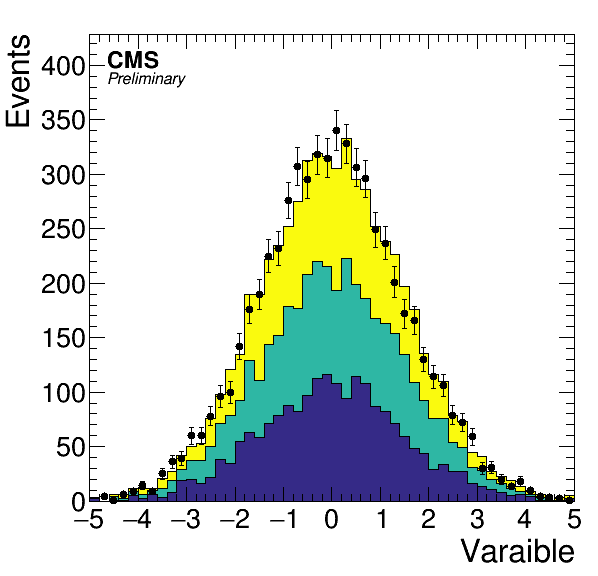
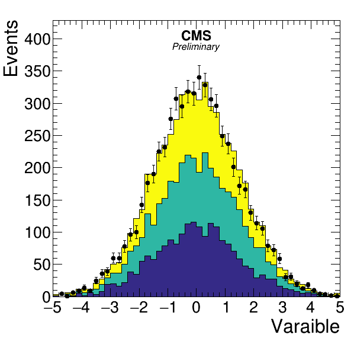
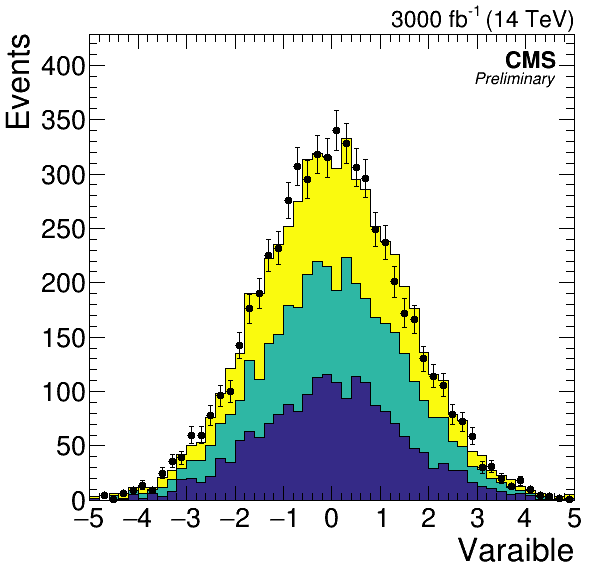
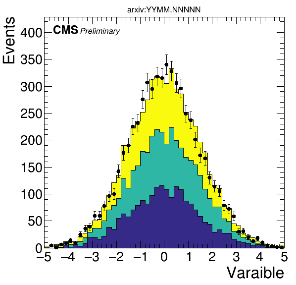
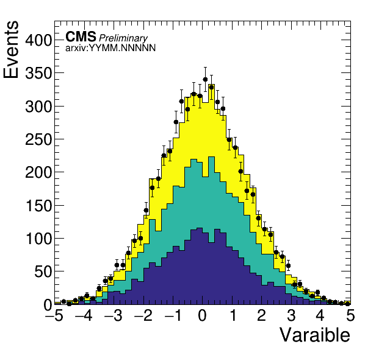
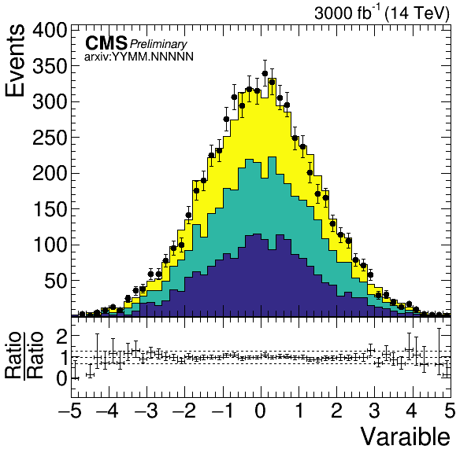

# ROOT Canvas CMS Styling with Python

## Installation
----------------
Clone this repository, then navigate to the directory and install using `pip`.
```bash
git clone https://github.com/singh-ramanpreet/pyroot_cms_scripts.git
git checkout 0.3.1
cd pyroot_cms_scripts
pip install --user .
```

## Usage
---------
Import the functions,
```python
from pyroot_cms_scripts import CMS_style, CMS_text
```
### CMS_style

`CMS_style` is instance of `ROOT.TStyle`, to update the changes in properties you will have to do `CMS_style.cd()`.

Just doing `CMS_style.cd()` will activate `CMS_style`. If you are reading histograms from a file, you need to do `ROOT.gROOT.ForceStyle()` before reading for this to work.

Alternatively, use can do `hist.UseCurrentStyle()` on every histograms.

### CMS_text

The function takes input of instance of `TCanvas` or `TPad`.

Below are keyword arguments and their default values, followed by some examples.
    
    Parameters
    ----------
    pad : instance of ROOT.TPad or ROOT.TCanvas
        pad or canvas to draw on
    draw_cms : bool, optional
        draws "CMS" text (default is True)
    cms_text : str, optional
        cms text (default is "CMS")
    cms_text_scale : float, optional
        scale cms_text (default is 1.0)
    cms_text_location : str, optional
        location of cms_text (default is "inside left")
        options, "outside left"
                 "inside left"
                 "inside center"
                 "inside right"
    cms_pos_x_scale : float, optional
        for fine positioning of cms_text (default is 1.0)
    cms_pos_y_scale : float, optional
        for fine positioning of cms_text (default is 1.0)
    draw_extra_text : bool, optional
        draw extra text next cms_text (default is False)
    extra_text: str, optional
        extra text (default is "Preliminary")
    extra_text_location : str, optional
        location of extra_text, (default is "inside left below")
        options, "outside left right"
                 "inside left below"
                 "inside left right"
                 "inside center below"
                 "inside right below"
                 "outside center"
    extra_pos_x_scale : float, optional
        for fine positioning of extra_text (default is 1.0)
    extra_pos_y_scale : float, optional
        for fine positioning of extra_text (default is 1.0)
    
    draw_lumi_text : bool, optional
        draw lumi text on top right outside frame (default is False)
    lumi_text: str, optional
        extra text (default is "#scale[0.95]{3000 fb^{1} (14 TeV)}")
    lumi_pos_x_scale : float, optional
        for fine positioning of lumi_text (default is 1.0)
    lumi_pos_y_scale : float, optional
        for fine positioning of lumi_text (default is 1.0)
    
    Returns
    -------
    instance of ROOT.TLatex used to draw.
    
```python
CMS_text(canvas, cms_text_location="outside left", draw_extra_text=True, extra_text_location="outside left right", draw_lumi_text=True)
```


```python
CMS_text(canvas, cms_text_location="inside left", draw_extra_text=True, extra_text_location="inside left below")
```


```python
CMS_text(canvas, cms_text_location="inside left", draw_extra_text=True, extra_text_location="inside left right")
```


```python
CMS_text(canvas, cms_text_location="inside center", draw_extra_text=True, extra_text_location="inside center below")
```


```python
CMS_text(canvas, cms_text_location="inside right", draw_extra_text=True, extra_text_location="inside right below", draw_lumi_text=True)
```


```python
CMS_text(canvas, cms_text_location="inside left", draw_extra_text=True, extra_text_location="inside left right")
CMS_text(canvas, draw_cms=False, draw_extra_text=True, extra_text_location="outside center", extra_text="#font[42]{arxiv:YYMM.NNNNN}")
```


```python
CMS_text(canvas, cms_text_location="inside left", draw_extra_text=True, extra_text_location="inside left right")
CMS_text(canvas, draw_cms=False, draw_extra_text=True, extra_text_location="inside left below", extra_text="#font[42]{arxiv:YYMM.NNNNN}")
```


```python
...
upper_pad = ratio.GetUpperPad()
upper_pad.cd()
...
CMS_text(upper_pad, cms_text_scale=1.2, cms_text_location="inside left", draw_extra_text=True, extra_text_location="inside left right", extra_text="#scale[1.1]{Preliminary}", extra_text_pos_x_scale=1.02, draw_lumi_text=True, lumi_text="#scale[1.1]{3000 fb^{-1} (14 TeV)}")
CMS_text(upper_pad, draw_cms=False, draw_extra_text=True, extra_text_location="inside left below", extra_text="#scale[1.1]{#font[42]{arxiv:YYMM.NNNNN}}", extra_text_pos_y_scale=1.05)
```

